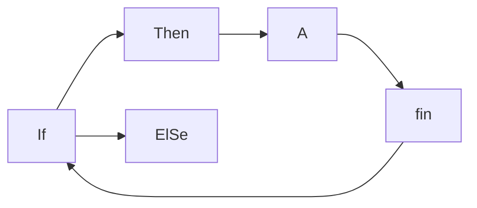

+++
title = 'Programación'
date = 2024-10-04T17:04:50+02:00
draft = false
weight = 9
+++



# PHP

{}Muy importante{} Si quieres ir a la página de php 

{}
Esta es un lectura

Muy importante 

un poco larga y no quiero que ocupe toda la pantalla

{}

{} presiona aquí {}
{}Get Hugo{}
{}Get Hugo{}